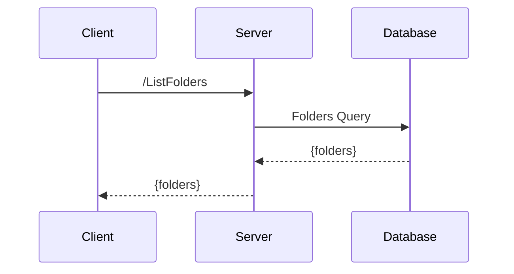

# benchmark

## requirements

- Docker
- Docker Compose
- Make

## stack

- **database**: postgres
- **observability**: prometheus, grafana
- **golang**: connect-rpc , grpc-go (WIP)
- **java**: grpc-java (WIP) , spring-boot (WIP)
- **nodejs**: grpc-nodejs (WIP) , express (WIP)

## setup

### environment

```bash
make start-monitoring
```

- open grafana [http://localhost:3000](http://localhost:3000)
- open prometheus [http://localhost:9090](http://localhost:9090)

```bash
make start-stack
```


```bash
make build-protobuf-gen-image
```


### Go - connect-rpc

- explore the plugins in use
  - [viqueen/protoc-gen-connect-go-backend](https://github.com/viqueen/protoc-gen-connect-go-backend)
  - [viqueen/protoc-gen-sqlc](https://github.com/viqueen/protoc-gen-sqlc)

- generate code

```bash
make local-go-codegen
```

- start the server

```bash
make start-connect-go
```

## flow


