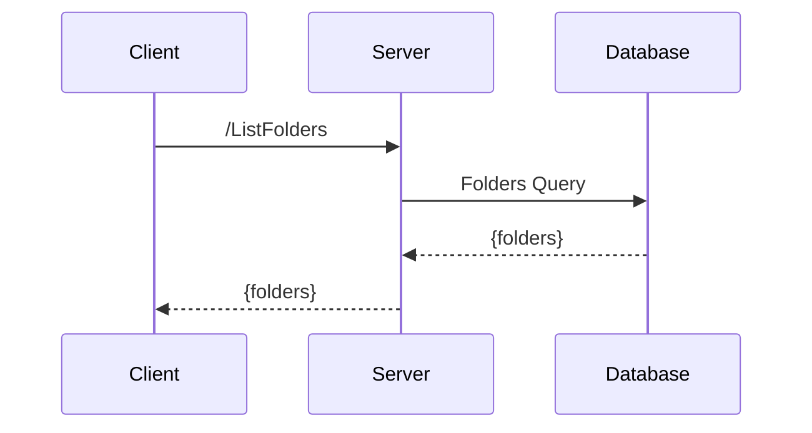

# benchmark

## requirements

- Docker
- Docker Compose
- Make

## setup

### observability

```bash
make monitoring
```

- open grafana [http://localhost:3000](http://localhost:3000)
- open prometheus [http://localhost:9090](http://localhost:9090)

### codegen

- build protobuf-gen locally

```bash
make build-protobuf-gen-image
```

- generate code

```bash
make local-schema-codegen
```

## flow


